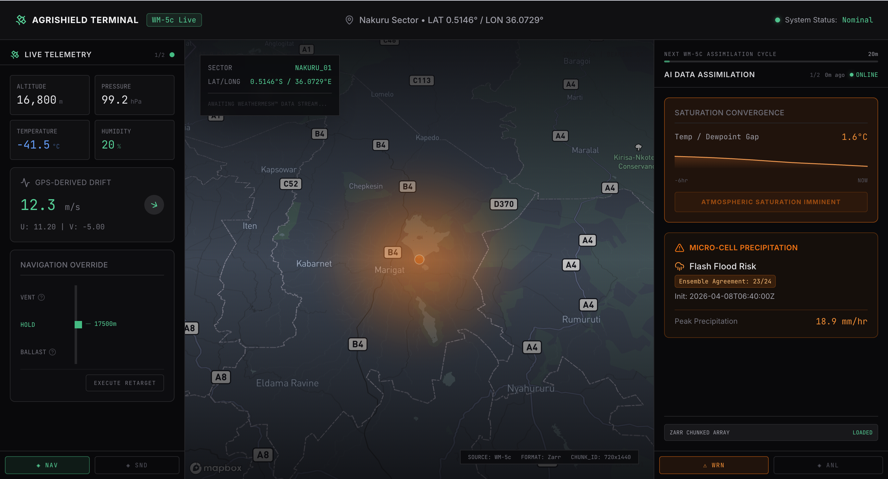
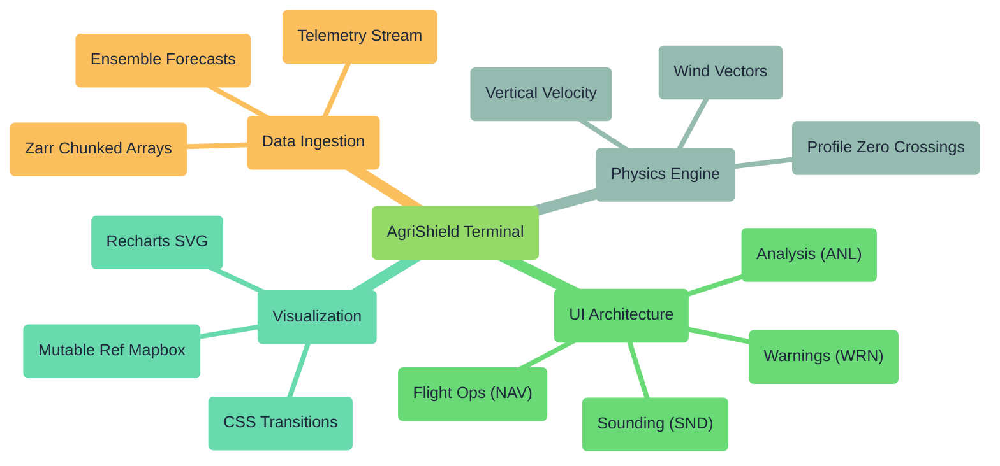
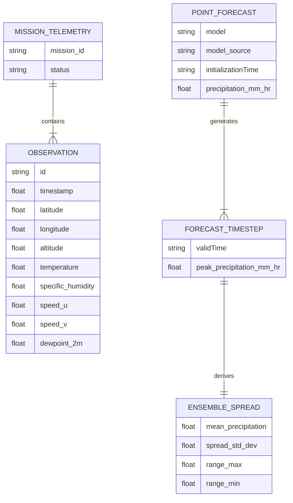
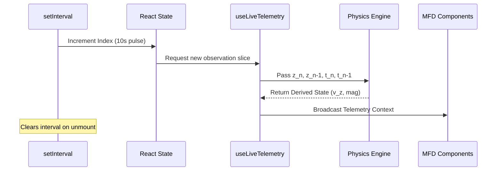
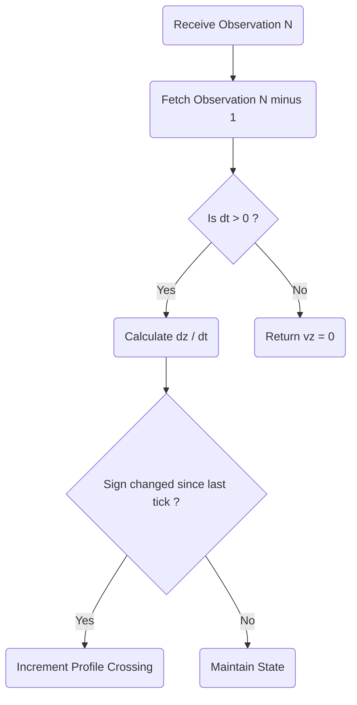
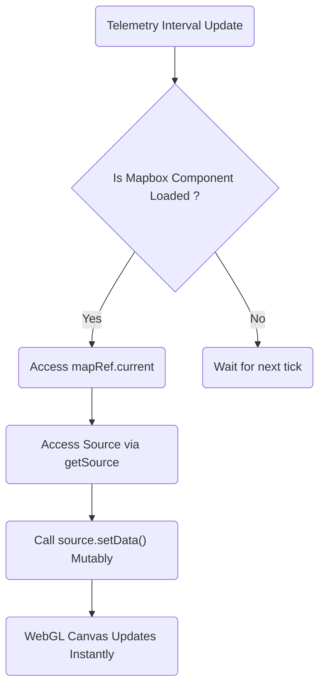
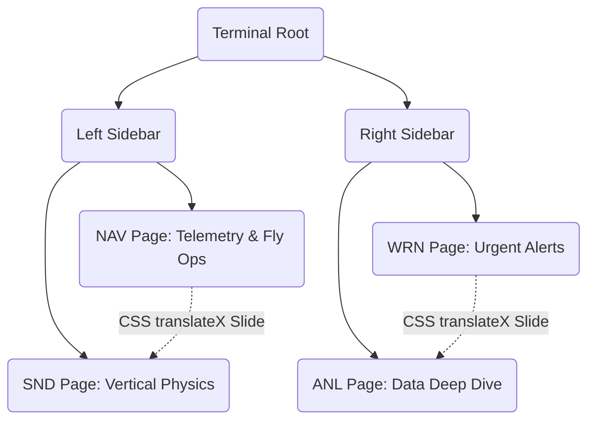
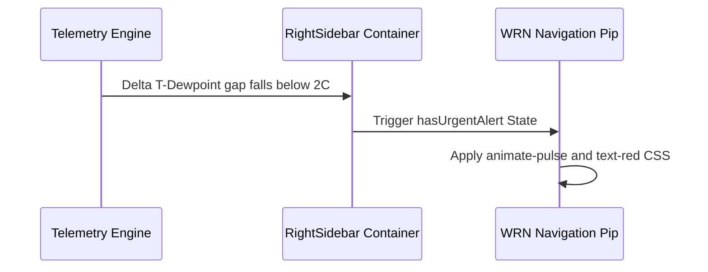
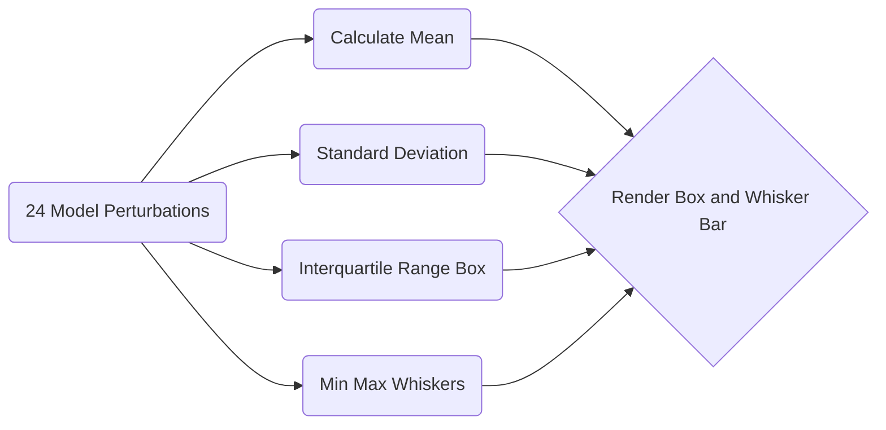
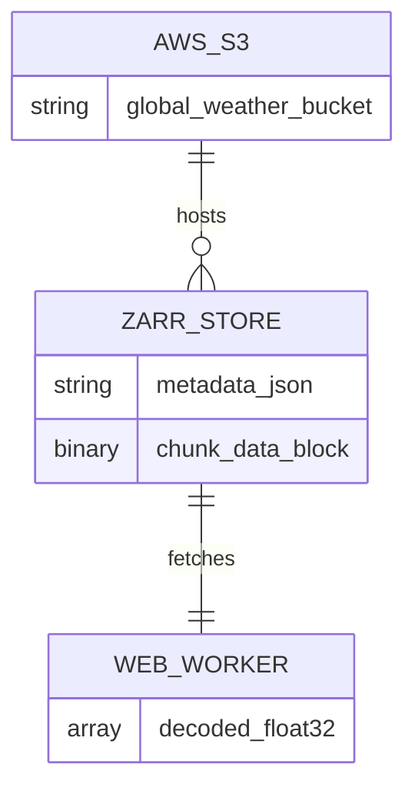

# AgriShield Terminal

A high-fidelity prototype dashboard simulating WindBorne Systems' Atlas balloon constellation and WeatherMesh WM-5c forecast model.

**Tech Stack:** Built with Next.js 15, Mapbox GL JS, TypeScript, Tailwind CSS v4, shadcn/ui, and Recharts.

---

## How I Built the AgriShield Terminal

Hi! If you're reading this, you're probably looking under the hood of the AgriShield Terminal. I wanted to put this document together to walk you through my thought process, the architecture, and some of the tough trade-offs I had to make while building this.

When I set out to build this, my main goal wasn't just to throw points on a map. I wanted to build a genuine, high-stakes situational awareness tool. I realized pretty early on that the biggest value proposition I could deliver was the **Forecast Delta Toggle**. 

The "aha!" moment for me was realizing that operators don't care about what the weather *is*; they care about what legacy models *missed*. By explicitly visualizing the difference between standard ECMWF data and high-res WM5c micro-cell predictions, I give the user the exact risk delta they need to take action.

Here is a high-level mind map of how I structured the entire terminal:

### Visual 1: How I Structured the System

---

## 1. Data Contracts: Why I Avoided GeoJSON Here

When I was designing the data layer to match the WindBorne API, I had to make an important decision trade-off. It's really tempting to just bundle coordinates into GeoJSON tuples `[lng, lat]` right off the bat because Mapbox loves them. 

But I decided against it. I kept latitude, longitude, and altitude as discrete, independent numbers in my state arrays. From a scientific perspective, spatial dimensions need to be treated as independent scalar variables for the thermodynamic math I wanted to run later. I can always format them for Mapbox at the very end of the line.

### Visual 2: The Core Data Relationships

---

## 2. The Playback Engine: Faking a Satellite

One of the trickiest features I implemented was the playback engine. I needed to simulate a continuous 10-second Iridium sat-link downlink to test how the UI handles sustained data updates over time. 

I set up a React hook (`useLiveTelemetry`) that uses a strict `setInterval` to grab slices of the mock array. A huge pitfall I actively avoided here was memory leaking. React 18's strict mode and frequent unmounting will spawn infinite orphaned timers if you aren't careful, so I made sure to strictly clear the interval in the cleanup function. 

### Visual 3: My Downlink Synchronization Loop

---

## 3. The Math: Writing a Mini Physics Engine

I really didn't want the terminal to just parrot back the data it was fed. I wanted it to offer *derived* intelligence. So, I wrote a small physics parser that runs on every tick.

For example, calculating Vertical Velocity ($v_z$) allows me to determine exactly what flight phase the balloon is in without querying an external endpoint.

$$v_z = \frac{z_n - z_{n-1}}{t_n - t_{n-1}}$$

### Visual 4: Detecting Profile Crossings

If the balloon is doing vertical sounding sweeps, it'll constantly cross the $v_z = 0$ threshold. I track these crossings to show the user how many sweeps the asset has completed.

I also take the raw `speed_u` and `speed_v` vectors and derive absolute magnitude on the client:

$$\text{mag} = \sqrt{speed\_u^2 + speed\_v^2}$$

---

## 4. Mapbox and WebGL: The Mutable Ref Pattern

This was probably my biggest technical hurdle. React's virtual DOM is fast, but if you bind Mapbox coordinates directly to React state variables, the map ends up stuttering and dropping frames because it's constantly reconciling the DOM tree alongside WebGL repaints.

To solve this, I made a major architectural trade-off: I bypassed React state for the map entirely.

### Visual 5: How I Bypass React for Mapbox Updates

I track the map instance using `useRef`. Whenever the telemetry hook updates, I just grab the source layer directly via `map.getSource()` and mutably inject the new GeoJSON data. It is buttery smooth.

## 5. UI Architecture: Killing the Scrollbar

I'm a firm believer that critical operational dashboards shouldn't require scrolling. If an alert is buried below the fold, it might as well not exist.

To fix this, I took a lot of inspiration from aviation Multifunction Displays (MFDs). I split the left and right sidebars into distinct "pages" that you tab between. 

### Visual 6: My Paged Sidebar Hierarchy

I used CSS `translateX` for the sliding animations because I wanted to keep the components mounted at all times. If I conditionally rendered them, I'd trigger massive garbage collection spikes every time the heavy Recharts SVGs were destroyed and recreated.

### Visual 7: Asynchronous Attention Grabbing

But what happens if there's an urgent warning, but the user is looking at the Analysis page? I built a small asynchronous feedback loop. If a saturation alert fires and you aren't on the Warning page, the WRN pip at the bottom starts pulsing bright red to forcefully attract your attention.

---

## 6. Weather Nerd Details: Ensembles and Humidity

Since this project deals with high-altitude stratospheric data, I wanted to make sure it was scientifically defensible.

I opted to track `specific_humidity` (mg of water per kg of air) rather than standard Relative Humidity (RH%). In the extreme cold of the stratosphere, the air holds so little moisture that RH percentages become highly deceptive. Specific humidity gave me an absolute, pressure-independent metric to build my saturation alerts around.

### Visual 8: Why I Used Ensemble Spread Instead of "Confidence Scores"

I decided early on that returning a simple "85% Confidence" score was a cop-out. It creates a false sense of security. Instead, I wired up the UI to visualize the variance of a full 24-member prediction ensemble. I built a custom Box-and-Whisker range bar that surfaces the actual probabilistic spread—allowing operators to see exactly *how* wide the variance is, rather than just trusting a single deterministic number.

---

## 7. Looking Forward: Zarr Integration

I mocked out a lot of the array data here to prove out the UI interactions. But I purposefully built the terminal to be extensible for when we plug this into a real high-throughput backend—specifically focusing on Zarr chunked arrays hosted out of an S3 bucket.

### Visual 9: My Plan for Cloud Extensibility

If I get more time to work on this, the next iteration will spin up a background Web Worker. That worker will ask the Mapbox canvas for its exact bounding box and then pull *only* the Zarr chunks that fall within that specific geographical region. It completely eliminates the bloated memory overhead of downloading global parameter sets.

---
*Thanks for reading through this! I put a lot of heart into getting the balance right between raw scientific utility and human-centric design, and I really enjoyed the architectural challenges it brought up.*
